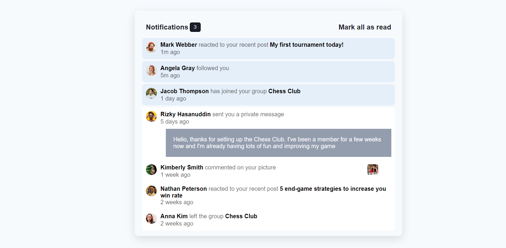

# Notification Page

## Project Status

<h3> completed</h3>

# Table of contents

- [Overview](#overview)
  - [The challenge](#the-challenge)
  - [Links](#links)
- [My process](#my-process)
  - [Built with](#built-with)
  - [What I learned](#what-i-learned)
  - [Useful resources](#useful-resources)

## Overview

### The challenge

Users should be able to:

- Distinguish between "unread" and "read" notifications
- Select "Mark all as read" to toggle the visual state of the unread notifications and set the number of unread messages to zero
- View the optimal layout for the interface depending on their device's screen size
- See hover and focus states for all interactive elements on the page

### Links

- Repository URL: [Repositiory Link](https://github.com/svandu/notification-page)
- Live Site URL: [Live site Link](https://notification-page-flame.vercel.app/)

## My process

### Built with

- Semantic HTML5 markup
- CSS custom properties
- Flexbox
- CSS Grid
- [React](https://reactjs.org/) - JS library

### What I learned

- React hooks 
- How to use useState to change the state of the components 
- React component file and folder structure
- to make responsive page

### Continued development

- Implementing and managing the state of the components using React hooks. 

## Author

- Website - [surbhi-vandana](https://github.com/svandu/notification-page)
- Frontend Mentor - [@svandu](https://www.frontendmentor.io/profile/svandu)
- Twitter - [Surbhi Vandana](linkedin.com/in/surbhi-vandana-65380b205)